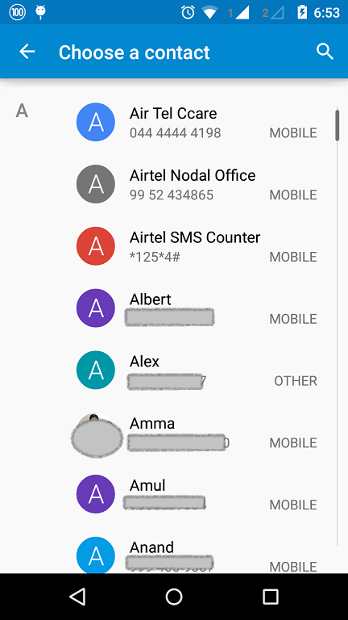

# Todo App

A PhoneGap Todo App

# Useful notes
# To install
 - Git 
 - Nodejs >= 6
 - Visual Code


# Install phonegap
1. npm install -g phonegap

2. phonegap template list

# Getting familiar with android tools

~/Library/Android/Sdk/tools/
 - `./monitor` to launch android device monitor, show logs
 - `./android` to launch the android sdk
 - `./android avd` to launch the avd
 - `./emulator  -list-avds` to list the available android emulator
 - 

> **Note:** Run the x86 emulator it's about 10x faster 
> **Note:** You should turn off other instance of VirtualBox 4.3 to run the emulator (until fixed)

## Session 03
We learned how to run the app from the emulator/device, manage app plugins, organize our code and move out services into separate files, and how to use a transpiler to transpile our JavaScript code to work on older platforms.

We have used the TypeScript transpiler version 2.2.2 at the time of writing.

### PhoneGap commands in this session

#### Plugins commands

You can search for plugins from http://cordova.apache.org/plugins/

 - `phonegap plugins list` to list installed plugins in my app
 - `phonegap plugins add <plugin-name>` to install a plugin from the internet
 - `phonegap plugins remove <plugin-name>` to remove an installed plugin

 > **note:** do not confuse between `cordova` and `phonegap` commands, always you should use `phonegap`

 

#### Running commands

 - `phonegap run` to run the application on the available devices/emulators for all platforms
 - `phonegap run android` to run the application on the available devices/emulators for android
 - `phonegap run ios` to run the application on the available devices/emulators for ios
 - `phonegap emulate` to run the application on the available emulators for all platforms
 - `phonegap emulate ios` to run the application on the available emulators for ios
 - `phonegap emulate android` to run the application on the available emulators for android


 ### Android commands in this session

You can find the path of android sdk by default under the following:

 - for mac users: `cd ~/Library/Android/sdk/`
 - for win users: `cd %USERPROFILE%/AppData/Local/Android/sdk`

 > **Warning:** These are the default, these path may change depend on your installation


 From the `<android-sdk-folder>/tools` run:
  - `./emulator -list-avds` to list the installed avd (Android Virtual Device)
  - `./emulator -avd <avd-name>` to run a specific avd

  > **note:** It's recommended to run the `x86` image if available
  > **note:** Android commands can be used directly from Android Studio

### Other commands

- `npm install -g typescript` to install the **tsc** compiler globally
- `tsc -v` should print out the compiler version, you can use this command to test if you have tsc installed or not
- `tsc --init` to initialize a new `tsconfig.json` file (this command should be run from my todo project)
- `tsc --watch --project .` to run the compiler in watch mode for this project (this command should be run from my todo project)

## Session 04
In this session we learned how to discover uncaught errors in our application, and how to make virtual pages.


### Inspect and debug errors

#### 1. Use the chrome inspector (most recommended)

By opening Google Chrome go to: `chrome://inspect` select **devices** tab, then click on **inspect** next to your emulator/device.


We can set **breakpoint** by clicking on the line number (under the **Sources** tab) or by writing `debugger;` in our code.


#### 2. Use android `monitor` tool

We can open this tool from `<ANDROID_SDK>/tools/monitor` or from **Android Studio** under **Tools**>**Android**>**Android Device Monitor**  


This tool show a list of connected devices, we can filter the logs by the application name, in our case the application name is: `com.example.todo`

#### 3. Wrapping our code with `try catch` statements

```js
function getItemsFromDatabase() {
  throw "No connection";
}

/// ....
/// some code here
/// ....

try {
  getItemsFromDatabase(); // this method will throw exception if no internet connection found
} catch(error) {
  alert('Make sure you have a valid internet connection');
}
```

> **Note for Bassam:** We have used the **throw** statement to simulate errors in our case.

### Virtual Pages
In our `index.html` page, we have wrapped our todo page with `<div id="todo-page">`, and created another `<div id="about-page">` to simulate virtual pages.

the content of the `index.html` page should be similar to:

```html
<div class="app">

    <div id="tabs">
        <button tab="todo-page">TODOS</button>
        <button tab="about-page">ABOUT</button>
    </div>

    <div id="todo-page">
        <div id="items">
            <!-- items will be rendered here -->
        </div>
        <input id="todoTxt" type="text">
        <button id="addBtn">+</button>
    </div>

    <div id="about-page">
        ABOUT CONTENT HERE
    </div>

</div>
```

> **Note:** the **tab** attribute in `<button tab="todo-page">TODOS</button>` has no special meaning,
in the next session we will see how to extract the name of the page from this attribute.

Next in our typescript file `index.ts` we wrote the below code to bind the click handler for each button

```js
  // setup navigation
  $('#todo-page').show();
  
  // show todo page
  $('[tab="todo-page"]').on('click', function () {
      $('#todo-page').show();
      $('#about-page').hide();
  });
  
  // show about page
  $('[tab="about-page"]').on('click', function () {
      $('#about-page').show();
      $('#todo-page').hide();
  });
```

To make the pages hidden by default, we added the `display:none` rule in the `index.css` file

```css
#todo-page {
    padding: 20px;
    min-height: 200px;
    border: 3px solid red;
    display: none; 
}

#about-page {
    padding: 20px;
    min-height: 200px;
    border: 3px solid green;
    display: none;
}
```

## Session 05
Some useful notes in this session:

### Ignore some typescript errors
instruct the typescript compiler to ignore the jQuery function `$` errors.
```ts
declare var $;
```

### JavaScript and Css files order matter
As a rule of thumb my code should be included after other libraries

```html
// ✅
<script type="text/javascript" src="js/jquery.min.js"></script>
<script type="text/javascript" src="js/index.js"></script>

// ❌
<script type="text/javascript" src="js/index.js"></script>
<script type="text/javascript" src="js/jquery.min.js"></script>
```
### jQuery is a library written in JavaScript
jQuery is a library that make it easy to manage DOM (Document Object Model) or the HTML, event handler, etc...


## Session 06 (Reusable component)
In this session we learned how to make a reusable component instead of hardcoding the elements in the code and how to use https://onsenui.com to give the app a native feeling.


### Reusable Component (tabs component)
We will teach the browser how to recognize the new elements: **tabs**, **tab**, **page-container** and **page**.

We followed these steps:

#### Define the markup (html)

```html

<tabs target="mypages">
    <tab class="active">
        My Todos
    </tab>
    <tab>
        About Page
    </tab>
    <tab>
        Hello
    </tab>
</tabs>

<page-container id="mypages">
    <page class="active">
        TODO PAGE
    </page>
    <page>
        About page
    </page>
    <page>
        Hello content
    </page>
</page-container>
```

##### Apply the visual style (css)
```css

tabs {
    display: block;  
    margin: 15px;  
}

tab {
    padding: 10px;
    color: #000;
    margin: 0 10px;
    border: 1px solid #000; 
    display: inline-block;
    cursor: pointer;
    border-radius: 5px;
    transition: .3s linear all;
}

tab.active {
    background: #0072bc;
    color: #fff;
    font-weight: bold;
}

tab:hover {
    color: #0072bc;
    border-color: #0072bc;
    background: orange;
}


page {
    display: none;
    border: 1px solid #000;
    padding: 20px;
}

page.active {
    display: block;
}
``` 

By default all pages are hidden except pages with class `active`.

#### Implement the component logic

Inside `www/ts/tabs.components.ts`

In this way we separate the tabs handling code outside of my project, **separation of concern** 

> **Keep in mind:** This component should work the same, regardless of the logic of my app, this is a good indicator that I am on the right track.

```ts

(function () {
    $('tabs').each(function () {
        var $tabs = $(this).find('tab');
        var selector = '#' + $(this).attr('target');

        var $pages = $(selector + ' page');

        $tabs.on('click', function () {
            var index = $(this).index();

            // hide pages and show current page
            $pages.removeClass('active');
            $($pages[index]).addClass('active');

            // remove active from tabs and add it to the current tab
            $tabs.removeClass('active');
            $($tabs[index]).addClass('active');
        });

    });
})()

```

### OnsenUI
We have downloaded the library code from [this link](https://github.com/OnsenUI/OnsenUI-dist/archive/2.3.2.zip)
We have referenced the following in our index.html page

```html
    <link rel="stylesheet" type="text/css" href="css/index.css" />

    <!-- ONSEN UI CSS -->
    <link rel="stylesheet" type="text/css" href="onsen/css/onsenui.css" />
    <link rel="stylesheet" type="text/css" href="onsen/css/onsen-css-components.css" />
```

and 
```html

    <script type="text/javascript" src="cordova.js"></script>
    <script type="text/javascript" src="js/jquery.min.js"></script>

    <!-- onsen ui js -->
    <script type="text/javascript" src="onsen/js/onsenui.js"></script>

    <script type="text/javascript" src="js/index.js"></script>
```

I highly recommend passing over [the components page](https://onsen.io/v2/docs/css.html) to get an overview of the components available

### Some useful notes in this session
In **CSS/jQuery** you can use `bassam antar` selector to select all `antar's` from `bassam`

for example

```html
<div id="book">
    <div class="page"></div>
    <div class="page"></div>
</div>
<div class="page"></div>
```

```css

.page {
    // this selector will match every `.page` element in the document
}

#book .page {
    // here it will match all `.page`'s inside the #book 
}

```

The **:hover** pseudo selector allows me to style the element when the mouse is over
```css 
button {
    color: black;
}

button:hover {
    color: red;
}
```

## Session 07 
In this session we have learned how to deal with the Device Contact Api (**navigator.contacts**) through the phonegap plugin [**Cordova Plugin Contact**](https://github.com/apache/cordova-plugin-contacts).

You can check it's documentation from [this link](https://github.com/apache/cordova-plugin-contacts).

In Brief this method have 3 main methods:

### navigator.contacts.create()
Documentation link: [create](https://github.com/apache/cordova-plugin-contacts#navigatorcontactscreate)

>**Note:** You have to call the **save()** method on the contact created by this method

A quick example:

```ts
var bassam = navigator.contacts.create();
bassam.displayName = "Bisso";
bassam.nickname = "Bisso";

// populate some fields for the name
var name = new ContactName();
name.givenName = "Bassam";
name.familyName = "Yamouni";

// setting the name for bassam
bassam.name = name;

bassam.phoneNumbers = [
    new Contact('home', '03 123 456').
    new Contact('work', '03 123 456').
    new Contact('mobile', '03 123 456').
]

bassam.save(); // to save the contact
```

Or we can put the elements inline (Choose the method you find easier)

```ts
var samer = contactsService.create({
    displayName: "Samer",
    name: new ContactName(null, "Samer", "Abou Chakra"),
    nickname: "Ballouta",
    phoneNumbers: [
        new ContactField('home', phoneNumbers),
    ],
    emails: [
        new ContactField('work', emails),
    ],
    note: note,
});


samer.save();
```

### navigator.contacts.find()
Documentation link: [find](https://github.com/apache/cordova-plugin-contacts#navigatorcontactsfind)

```ts
var options      = new ContactFindOptions();
options.filter   = 'Elie';

// setting this to false will return the first contact only
options.multiple = true; 

options.desiredFields = [navigator.contacts.fieldType.id];

options.hasPhoneNumber = true;

// Search in the following fields
var fields       = [navigator.contacts.fieldType.displayName, navigator.contacts.fieldType.name];

navigator.contacts.find(fields, function onSuccess(contacts) {
    // display the list of contacts
}, function onError(error) {
    // show an error message
}, options);
```

### navigator.contacts.pickContact()
Documentation link: [pickContact](https://github.com/apache/cordova-plugin-contacts#navigatorcontactspickcontact)

This method will open the native contact picker from the device



```ts
navigator.contacts.pickContact(function(contact){
    console.log('The following contact has been selected:' + JSON.stringify(contact));
},function(err){
    console.log('Error: ' + err);
});
```

### A summary of the Classes (or types) available in this plugin

- [Contact](https://github.com/apache/cordova-plugin-contacts#contact)
- [ContactName](https://github.com/apache/cordova-plugin-contacts#contactname)
- [ContactAddress](https://github.com/apache/cordova-plugin-contacts#contactaddress)
- [ContactField](https://github.com/apache/cordova-plugin-contacts#contactfield)
- [ContactFieldType](https://github.com/apache/cordova-plugin-contacts#contactfieldtype)
- [ContactOrganization](https://github.com/apache/cordova-plugin-contacts#contactorganization)

### Notes in this session
In JavaScript (Do not confuse with Java or other languages), object are very similar to arrays, so we can access objects with the bracket notation, so for example the following are the same:

```ts
var userName = contact['name'];
```
and 

```ts
var userName = contact.name;
```

>**Note:** Do not confuse, we've passed the property name as string in the first example. `contact['name']` and not `contact[name]`.
