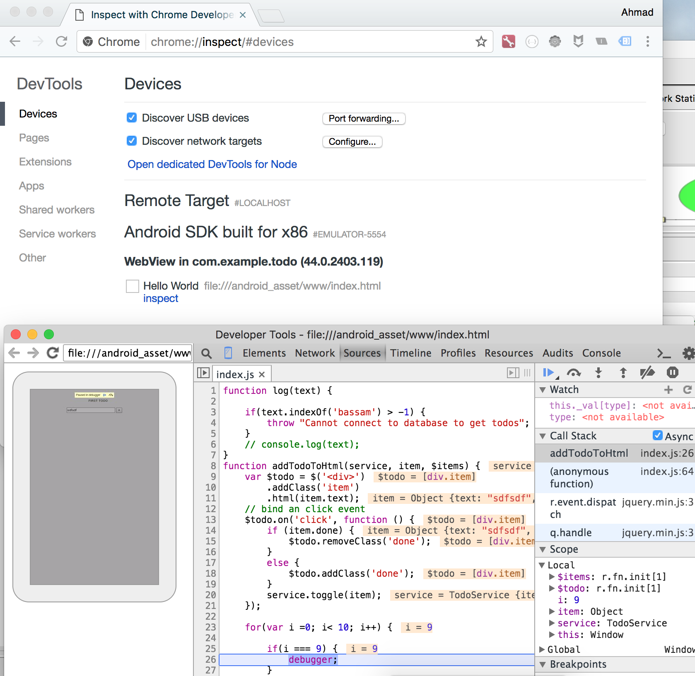

# Todo App

A PhoneGap Todo App

# Useful notes
# To install
 - Git 
 - Nodejs >= 6
 - Visual Code


# Install phonegap
1. npm install -g phonegap

2. phonegap template list

# Getting familiar with android tools

~/Library/Android/Sdk/tools/
 - `./monitor` to launch android device monitor, show logs
 - `./android` to launch the android sdk
 - `./android avd` to launch the avd
 - `./emulator  -list-avds` to list the avAndroid_Accelerated_x86ailable android emulator
 - 

> **Note:** Run the x86 emulator it's about 10x faster 
> **Note:** You should turn off other instance of VirtualBox 4.3 to run the emulator (until fixed)

## Session 03
We learned how to run the app from the emulator/device, manage app plugins, organize our code and move out services into separate files, and how to use a transpiler to transpile our JavaScript code to work on older platforms.

We have used the TypeScript transpiler version 2.2.2 at the time of writing.

### PhoneGap commands in this session

#### Plugins commands

You can search for plugins from http://cordova.apache.org/plugins/

 - `phonegap plugins list` to list installed plugins in my app
 - `phonegap plugins add <plugin-name>` to install a plugin from the internet
 - `phonegap plugins remove <plugin-name>` to remove an installed plugin

 > **note:** do not confuse between `cordova` and `phonegap` commands, always you should use `phonegap`

 

#### Running commands

 - `phonegap run` to run the application on the available devices/emulators for all platforms
 - `phonegap run android` to run the application on the available devices/emulators for android
 - `phonegap run ios` to run the application on the available devices/emulators for ios
 - `phonegap emulate` to run the application on the available emulators for all platforms
 - `phonegap emulate ios` to run the application on the available emulators for ios
 - `phonegap emulate android` to run the application on the available emulators for android


 ### Android commands in this session

You can find the path of android sdk by default under the following:

 - for mac users: `cd ~/Library/Android/sdk/`
 - for win users: `cd %USERPROFILE%/AppData/Local/Android/sdk`

 > **Warning:** These are the default, these path may change depend on your installation


 From the `<android-sdk-folder>/tools` run:
  - `./emulator -list-avds` to list the installed avd (Android Virtual Device)
  - `./emulator -avd <avd-name>` to run a specific avd

  > **note:** It's recommended to run the `x86` image if available
  > **note:** Android commands can be used directly from Android Studio

### Other commands

- `npm install -g typescript` to install the **tsc** compiler globally
- `tsc -v` should print out the compiler version, you can use this command to test if you have tsc installed or not
- `tsc --init` to initialize a new `tsconfig.json` file (this command should be run from my todo project)
- `tsc --watch --project .` to run the compiler in watch mode for this project (this command should be run from my todo project)

## Session 04
In this session we learned how to discover uncaught errors in our application, and how to make virtual pages.


### Inspect and debug errors

#### 1. Use the chrome inspector (most recommended)

By opening Google Chrome go to: `chrome://inspect` select **devices** tab, then click on **inspect** next to your emulator/device.



We can set **breakpoint** by clicking on the line number (under the **Sources** tab) or by writing `debugger;` in our code.


#### 2. Use android `monitor` tool

We can open this tool from `<ANDROID_SDK>/tools/monitor` or from **Android Studio** under **Tools**>**Android**>**Android Device Monitor**  


This tool show a list of connected devices, we can filter the logs by the application name, in our case the application name is: `com.example.todo`

#### 3. Wraping our code with `try catch` statements

```js
function getItemsFromDatabase() {
  throw "No connecction";
}

/// ....
/// some code here
/// ....

try {
  getItemsFromDatabase(); // this method will throw exception if no internet connection found
} catch(error) {
  alert('Make sure you have a valid internet connection');
}
```

> **Note for Bassam:** We have used the **throw** statement to simulate errors in our case.

### Virtual Pages
In our `index.html` page, we have wrapped our todo page with `<div id="todo-page">`, and created another `<div id="about-page">` to simulate virtual pages.

the content of the `index.html` page should be similar to:

```html
<div class="app">

    <div id="tabs">
        <button tab="todo-page">TODOS</button>
        <button tab="about-page">ABOUT</button>
    </div>

    <div id="todo-page">
        <div id="items">
            <!-- items will be rendered here -->
        </div>
        <input id="todoTxt" type="text">
        <button id="addBtn">+</button>
    </div>

    <div id="about-page">
        ABOUT CONTENT HERE
    </div>

</div>
```

> **Note:** the **tab** attribute in `<button tab="todo-page">TODOS</button>` has no special meaning,
in the next session we will see how to extract the name of the page from this attribute.

Next in our typescript file `index.ts` we wrote the below code to bind the click handler for each button

```js
  // setup navigation
  $('#todo-page').show();
  
  // show todo page
  $('[tab="todo-page"]').on('click', function () {
      $('#todo-page').show();
      $('#about-page').hide();
  });
  
  // show about page
  $('[tab="about-page"]').on('click', function () {
      $('#about-page').show();
      $('#todo-page').hide();
  });
```

To make the pages hidden by default, we added the `display:none` rule in the `index.css` file

```css
#todo-page {
    padding: 20px;
    min-height: 200px;
    border: 3px solid red;
    display: none; 
}

#about-page {
    padding: 20px;
    min-height: 200px;
    border: 3px solid green;
    display: none;
}
```